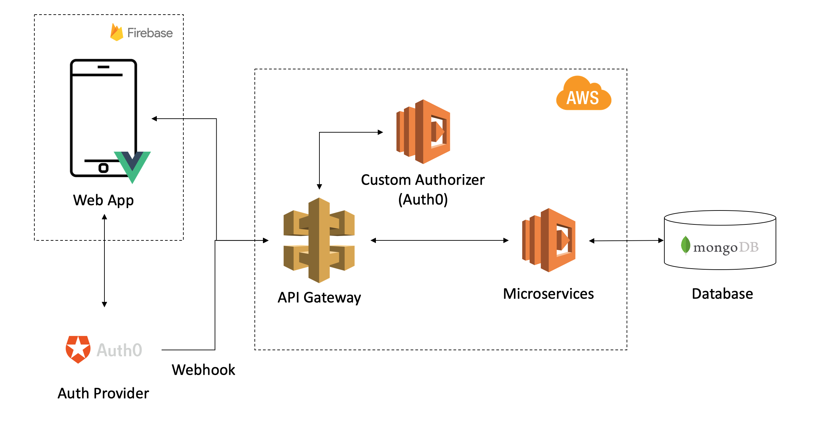

# theHotel Backend Server

 

The backend server is hosted on AWS, which mainly uses Amazon API Gateway and AWS Lambda.

Auth0 is used as the trusted provider for authentication and authorization. A authorizer (AWS Lambda) is attached to the API Gateway to verify each incoming request.

## Developer Guide

### Pre-requisites
1. Node `v8.12.0` or later
2. NPM `v6.4.0` or later
3. Git
4. Visual Studio Code IDE

### Getting started
1. Download and unzip the source code
2. Install NPM packages  
   `npm install`

### How to deploy
1. Follow the [AWS documentation](https://docs.aws.amazon.com/cli/latest/userguide/installing.html) to install the AWS CLI on your machine.
2. Follow the [AWS documentation](https://docs.aws.amazon.com/cli/latest/userguide/cli-chap-getting-started.html) to configure your company credentials on your machine.
   - For Linux, macOS, or Unix your CLI configuration file will be created at ~/.aws/credentials
   - For Windows, your CLI configuration file will be created at C:\Users\<username> \.aws\credentials
3. Deploy your server  
   `serverless deploy`
